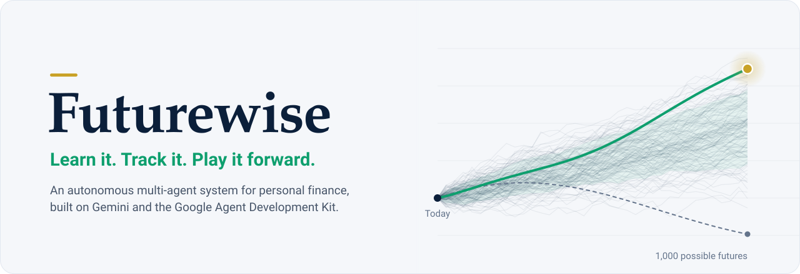
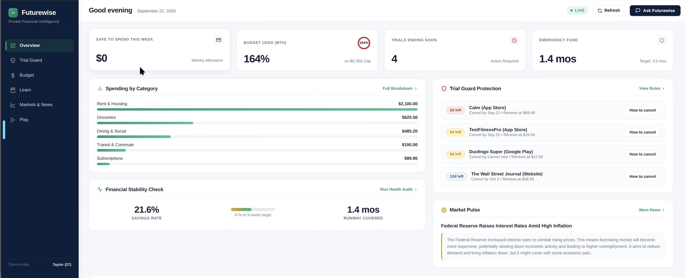
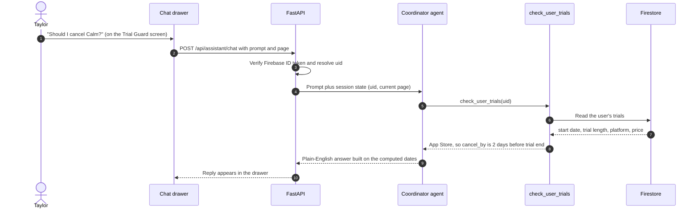
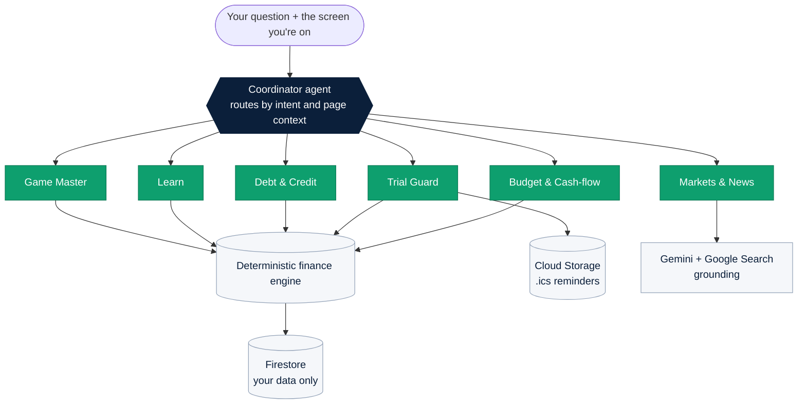

# Futurewise
> *"Learn it. Track it. Play it forward."*

Futurewise is a full-stack, multi-agent, autonomous personal finance platform engineered to help everyday people—especially those without a background in finance—make sound, mathematically optimal money decisions. Futurewise delivers a bank-grade fintech dashboard where a coordinated team of specialist AI agents works behind every screen.

<div align="center">

<br>



<br><br>


[A look inside](#-a-look-inside) &nbsp;|&nbsp; [Architecture](#-architecture--core-systems) &nbsp;|&nbsp; [Meet Taylor](#-meet-taylor) &nbsp;|&nbsp; [The agents](#phase-2-multi-agent-system-adk) &nbsp;|&nbsp; [Life Mode](#phase-4-life-mode-the-game) &nbsp;|&nbsp; [Run it](#%EF%B8%8F-local-development--deployment)

</div>

---

## 👀 A look inside

<p align="center">
  
</p>

<p align="center"><sub>Taylor's dashboard running live on 22 September 2026. This is the first-generation frontend, so its demo data differs from the v2 seed described below.</sub></p>

| 7 | 10 | 15 | 45 | 6 | 1,000 |
|:---:|:---:|:---:|:---:|:---:|:---:|
| cooperating Gemini agents | app screens | tax-year-2026 lessons | quiz questions | life chapters | simulated lives per report card |

---

## 🌟 Architecture & Core Systems

```
┌────────────────────────────────────────────────────────────────────────┐
│                        Vanilla SPA Web Frontend                        │
│             (Private-Banking Aesthetic, Hash Router, A2UI)             │
└───────────────────────────────────┬────────────────────────────────────┘
                                    │ HTTP / REST
                                    ▼
┌────────────────────────────────────────────────────────────────────────┐
│                     FastAPI Application Gateway                        │
│                 (/v2/backend, Firebase Token Auth)                     │
└───────┬───────────────────────────┬────────────────────────────┬───────┘
        │                           │                            │
        ▼                           ▼                            ▼
┌─────────────────┐       ┌──────────────────┐         ┌─────────────────┐
│ Cloud Firestore │       │  ADK Multi-Agent │         │ Cloud Scheduler │
│  (User Scoped)  │       │   Coordinator    │         │ (8am Daily Cron)│
└─────────────────┘       └─────────┬────────┘         └────────┬────────┘
                                    │                           │
                   ┌────────────────┴────────────────┐          ▼
                   ▼                                 ▼  ┌────────────────┐
         Specialist Agents                   Autonomous │ Daily Autopilot│
       • Budget & Cash-Flow                   Execution │ Scan & Briefs  │
       • Trial Guard (0-risk cancel)                    └────────────────┘
       • Debt Avalanche/Snowball
       • Learn & Tax Education
       • Markets & News Macro Pulse
       • Life Mode Game Master
```

Every request enters through the FastAPI gateway, which verifies the Firebase ID token before any data is touched. From there it takes one of three routes: straight to the deterministic finance engine and Firestore for dashboard data, into the ADK multi-agent coordinator for conversation, or, once a day, into the Autopilot scanner.

### A question, end to end



Trial deadlines are never stored. They're computed at read time from the start date and trial length, so they can't drift out of date.

### Built on Google Cloud

| Service | What it does in Futurewise |
|---|---|
| **Gemini 2.5 Flash** (Vertex AI) | Reasoning and routing for all seven agents |
| **Google Agent Development Kit** | Multi-agent hierarchy, tool calling, per-user sessions |
| **Google Search grounding** | Live macroeconomic headlines with sources and dates |
| **Cloud Run** | Serves the API, the agent system and the SPA from one container |
| **Cloud Firestore** | User-scoped data under `users/{uid}/…` plus `tax_limits/2026` reference data |
| **Firebase Authentication** | Email/password and Google sign-in, verified server-side with `firebase-admin` |
| **Cloud Storage** | Hosts generated `.ics` calendar reminders |
| **Cloud Scheduler** | Triggers the daily Autopilot scan at 8 am Eastern |

---

## 🚀 Key Features by Phase

### Phase 1: Accounts & Database

- Firebase Authentication with email/password and Google login.
- User-scoped Firestore subcollections: `accounts`, `transactions`, `budgets`, `sinking_funds`, `trials`, `subscriptions`, `goals`, `debts`, `lesson_progress`, `game_saves`, `alerts`, `briefs`.
- Full CRUD REST API with single-click demo persona seeding (`Taylor Reynolds`, 27, NYC).
- Data portability: 1-click export to structured JSON or flattened CSV, and cascading GDPR/CCPA account deletion.

#### 👋 Meet Taylor

Taylor Reynolds is 27, designs products in New York, and takes home **$4,150 a month**. There's $7,500 in a high-yield savings account, $1,420 on a card charging **24.24% APR**, an $18,200 federal student loan, and three free trials quietly running in the background.

Taylor doesn't want a finance hobby. Taylor wants to not get burned.

One click seeds Taylor with 62 transactions, five budgets, two sinking funds, two goals and two debts. Before Taylor types a single word, Futurewise has already worked this out:

| Futurewise noticed | The answer | Why |
|---|---|---|
| Calm's 7-day **App Store** trial converts to an **annual** plan | **Cancel today** | App Store trials get a 2-day safety buffer. Missing it is a $69.99 charge, so it's flagged as a high-cost renewal. |
| Duolingo Super on Google Play | 5 days to cancel | Marked as a warning, with a one-click `.ics` calendar reminder |
| Safe to spend this week | **$698.15** | $767.96 left across five budgets, spread over the 1.1 weeks left in September |
| Budget used this month | **77.6%** | 2.4 points short of the 80% line where Autopilot starts raising alerts |
| Emergency runway | **2.5 months** | $7,500 in savings against $3,030/month of essentials (rent, groceries, transit, utilities) |
| Which debt first | **The card** | Its 24.24% APR dwarfs the loan's 4.8%, so Avalanche attacks it first |

<sub>Snapshot from the seeded demo on 23 September 2026. Trial deadlines are set relative to the day you seed, so the Calm alert always lands on "today".</sub>

**None of those numbers came from a language model.** The agents decide which question to ask. Python answers it.

#### 🔒 Security & privacy

- **Your data is only yours.** Everything lives under `users/{uid}/…`, and the Firestore rules allow a signed-in user to touch only their own tree.
- **Tokens are verified server-side.** Every request is checked with `firebase-admin` before any data is read.
- **No bank credentials, ever.** Futurewise works from balances and transactions you enter or seed. There's no account linking to leak.
- **Leaving is complete.** Account deletion removes all twelve collections, your profile and your Firebase Auth account.
- **Demo mode is explicit.** `DEMO_MODE=true` lets judges explore as Taylor without signing up. Set it to `false` and the demo token is rejected with a 403.

<details>
<summary><b>API reference</b></summary>

<br>

Every endpoint expects `Authorization: Bearer <Firebase ID token>`. With `DEMO_MODE=true`, `demo-token-<uid>` is also accepted.

| Method | Endpoint | Purpose |
|---|---|---|
| `GET` | `/api/health` | Liveness check |
| `GET` `PUT` | `/api/profile` | Read or update the user profile |
| `GET` | `/api/dashboard/overview` | Budget KPIs, safe-to-spend, runway, computed trials |
| `GET` | `/api/trials/computed` | Trials with deadlines, urgency and warnings |
| `GET` | `/api/trials/{id}/ics` | Download a cancel-by calendar reminder |
| `GET` | `/api/debts/payoff-schedule?extra_monthly=100` | Avalanche vs Snowball comparison |
| `POST` | `/api/assistant/chat` | Ask the coordinator agent (`prompt`, `page`) |
| `POST` | `/api/autopilot/run-now` | Run the Autopilot scan for the current user |
| `POST` | `/api/jobs/daily-scan` | Scan every user (Cloud Scheduler, `X-Cron-Secret` header) |
| `GET` | `/api/learn/lessons` · `/api/learn/lessons/{id}` | Lesson catalogue and detail |
| `POST` | `/api/learn/lessons/{id}/quiz` | Grade a quiz and save progress |
| `POST` | `/api/game/start` · `/choice` · `/rewind` · `/report` | Life Mode run, fork and report card |
| `GET` | `/api/game/current` | Resume the active run |
| `POST` | `/api/demo/seed` | Idempotently load Taylor's data |
| `GET` | `/api/settings/export?format=json\|csv` | Export all user data |
| `DELETE` | `/api/settings/delete-account` | Delete all data and the Firebase Auth user |
| `GET` `POST` `PUT` `DELETE` | `/api/{collection}[/{id}]` | CRUD for any of the 12 user collections |

</details>

### Phase 2: Multi-Agent System (ADK)

- **Coordinator Agent**: Context-aware routing based on active UI view and user intent.
- **Budget Agent**: Analyzes safe-to-spend weekly balances, budget vs actual, and cash-flow calendars.
- **Trial Guard Agent**: Computes countdown days, enforces conservative App Store 2-day cancellation buffers, and generates downloadable `.ics` calendar reminders.
- **Debt & Credit Agent**: Computes mathematical payoff schedules comparing Avalanche (highest APR first) and Snowball (lowest balance first), with credit utilization checks.
- **Learn Agent & News Agent**: Grounds educational concepts in tax rules (tax year 2026) and translates macroeconomic news for everyday budgets without stock tips.
- **Strict Sandbox Execution**: All monetary arithmetic is executed deterministically—never estimated by LLMs.

Futurewise is a hierarchy of seven Gemini agents built on the Google Agent Development Kit. The coordinator receives every question together with your verified user ID and the screen you're on. It answers with a tool directly or hands the conversation to one of six specialists. Each specialist has one job, its own instructions and guardrails, and only the tools that job requires.



| Agent | Job | Guardrail it enforces | Tools |
|---|---|---|---|
| **Coordinator** | Routes by intent and current page, carries the verified UID | Never invents numbers or asks for your user ID | All specialist tools, plus six sub-agents |
| **Budget & Cash-flow** | Safe-to-spend, budget vs actual, overdraft risk when checking minus upcoming bills drops under $200 | All math is deterministic | `analyze_budget_and_cashflow`, `run_financial_sandbox_calc` |
| **Trial Guard** | Countdowns, platform-aware cancel-by dates, calendar reminders | At least 2 days' buffer on App Store trials | `check_user_trials`, `create_trial_ics_reminder` |
| **Debt & Credit** | Avalanche vs Snowball, utilization, minimum-payment traps, BNPL stacking | Always links studentaid.gov for federal loans | `calculate_debt_payoff_plans` |
| **Markets & News** | Top macro headlines with sources, translated into everyday impact | Never recommends stocks or crypto trades | `search_financial_news` |
| **Learn** | Explains concepts using your real profile and 2026 limits | States the tax year and cites official sources | `get_user_profile`, `run_financial_sandbox_calc` |
| **Game Master** | Guides Life Mode trade-offs and timeline rewinds | Game state lives on the server, so rewinds are exact | `get_user_profile`, `run_financial_sandbox_calc` |

**Why seven agents instead of one big prompt?** Narrow instructions keep each guardrail tight and testable. The News agent's brief explicitly forbids stock and crypto picks, and the Debt agent's brief requires the studentaid.gov link for federal loans, so neither rule gets diluted by everything else the system knows. All seven run on Gemini 2.5 Flash with automatic retries, orchestrated by an ADK `Runner` with one persistent session per user and a 60-second ceiling per turn.

**Ask the system, and watch it route:**

> *"Which of my free trials should I cancel?"* → Trial Guard<br>
> *"How much can I spend this week without blowing my budget?"* → Budget & Cash-flow<br>
> *"Should I pay off my card or my student loan first?"* → Debt & Credit<br>
> *"What did the Fed just do, and does it matter for my savings?"* → Markets & News, grounded in live Google Search results<br>
> *"Explain HSA vs FSA using my numbers."* → Learn

### Phase 3: Autopilot (Autonomous Operations)

- Autonomous scanner triggers via Cloud Scheduler (`0 8 * * * America/New_York`) or on-demand.
- Flags trials ending $\le 3$ days, budgets exceeding 80%, upcoming overdraft risks (bills > checking), and generates daily executive Money Briefs.

Every scan writes its findings straight into your feed, so the important things find you instead of the other way round. Each issue becomes its own alert with a severity level: trial warnings turn critical inside one day, budget alerts turn high at 100%, and goals that hit their target get a milestone alert. The scan then files one daily Money Brief that counts what needs attention, reports your checking buffer, and explains one piece of macro news in terms of your savings and your card balance. You can run it any time from the Autopilot Feed; in production, Cloud Scheduler calls a secret-protected endpoint every morning.

### Phase 4: Life Mode (The Game)

- Life simulation chapters with choices, branching consequences, and live HUD tracking net worth, cash, debt, simulated credit score, and stress/happiness meters.
- 1,000-lives replay decision scoring (luck vs quality) and end-of-game report cards with unlockable achievements.

Six chapters. Ages 27 to 38. Every choice moves the HUD and unlocks the lesson that explains what just happened to you.

| Age | Chapter | The fork in the road |
|:---:|---|---|
| 27 | First career crossroads | A $5,000 signing bonus arrives the same month your rent goes up $200 |
| 29 | The healthcare surprise | A $3,200 ER bill: request the itemized bill and negotiate, or put it on a 24% card |
| 31 | Tech layoff wave | Four weeks of severance: lean on your emergency fund, or keep living on credit |
| 33 | The "guaranteed returns" pitch | 15% a month from a friend's DeFi pool, or a boring index fund |
| 35 | The 401(k) match | A 100% match on 6% of $95,000, or a financed sports car |
| 38 | Buying a home | 10% down with reserves intact, or drain everything to reach 20% |

**Rewind the timeline.** Jump back to any chapter and take the other path. It's a real fork: your stats are restored from that exact point in history, not reset.

**The 1,000-lives report card.** When the run ends, Futurewise replays your final position through 1,000 market scenarios (7% mean return, 15% volatility) and shows your bad-luck, median and good-luck outcomes next to a Decision Quality score and a letter grade. You see what you controlled separately from what the market did to you.

**Achievements** for the habits that matter: *Emergency Fortress*, *Scam Shield*, *Free Money Hero* and *Negotiation Master*.

**Three difficulty levels.** Easy starts with $10,000 cash and a 740 score. Normal starts from Taylor's real $19,620 debt load. Hard hands you $28,000 of debt, $2,500 in cash and a 640 score.

### Phase 5: Knowledge Library (Tax Year 2026)

- 15 comprehensive modules covering paystubs, W-4 withholding, 3-paycheck months, marginal vs effective tax rates, standard deductions, HYSAs, sinking funds, 401(k) matches, HSA vs FSA rules, and credit freezes. Each module includes a 3-question mastery quiz.

Each module answers the same three questions: why it matters, the mistake most people make, and what to do next. Quizzes pass at 66% and progress is saved to your account. Life Mode unlocks lessons as you play, so the game and the library feed each other.

| Topic | Lessons |
|---|---|
| Getting paid | Decoding your paystub · W-4 withholding: big refund vs breaking even · Biweekly pay and the 3-paycheck months |
| Taxes | Marginal vs effective rates (a raise never hurts you) · Standard deduction, deductions vs credits |
| Banking | HYSA vs checking · Sinking funds for irregular and annual bills |
| Credit & debt | Credit utilization and the statement grace period · Avalanche vs Snowball · Federal student loans and IDR plans |
| Workplace benefits | 401(k) match as an instant 100% return · HSA vs FSA |
| Retirement & investing | Roth vs Traditional IRA · Index funds vs stock picking and market timing |
| Protection | Free credit freezes and spotting financial scams |

### Phase 6: Fintech Edge Cases Handled

- Multi-bank CSV format column auto-mapping.
- Non-judgmental crisis guidance and assistance links (e.g. 211 resources, hospital bill itemization).
- Strict prompt-injection shielding treating financial transactions as data, not instructions.
- Mandatory official links (`studentaid.gov`, `irs.gov`, `consumerfinance.gov`).
- Refund-aware budgeting: returned items reduce a category's spend instead of being counted as expenses.
- Unknown trial platforms get the same conservative 2-day buffer as the App Store, and annual plans or anything priced at $40 or more get a high-cost renewal warning.
- Month-length-aware safe-to-spend: the weekly allowance divides what's left by the weeks actually remaining in the current month.

### Phase 7: Premium Bank-Grade Frontend

- Modern desktop-first design: `#F5F7FA` canvas, `#0B1F3A` deep navy, `#0E9F6E` emerald accents, `#C9A227` gold highlights, tabular numerals (`tnum`), and slide-in drawer assistant.

Ten screens share one design system. Dashboard buttons open the chat drawer with the question already written, and the drawer tells the agents which screen you're on.

| Screen | What you can do |
|---|---|
| **Executive Overview** | Safe-to-spend this week, budget used month-to-date, trials ending soon, emergency reserves and high-cost renewal warnings, all recomputed from raw data every time you look |
| **Accounts & Net Worth** | Total net worth, with checking, HYSA, credit card and loan balances in one view |
| **Budget & Cash-flow** | Budget vs actual per category, with spending rebuilt from transactions rather than stored totals |
| **Trial Guard & Subscriptions** | Countdown per trial, platform-aware cancel-by date, urgency level, and a downloadable `.ics` reminder |
| **Debt Payoff Planner** | Avalanche vs Snowball side by side: payoff order, months to debt-free and estimated interest, plus a studentaid.gov guardrail before anyone refinances federal loans |
| **Goals & Sinking Funds** | Emergency fund, Roth IRA max-out (the limit is read from Firestore's `tax_limits/2026`), and funds for irregular bills like renters insurance |
| **Knowledge Library** | 15 lessons for tax year 2026, each with a 3-question mastery quiz |
| **Life Mode** | A decade of financial decisions in six chapters |
| **Autopilot Feed** | Alerts and daily Money Briefs, plus a button to run the scan on demand |
| **Settings & Data Portability** | Export everything as JSON or CSV, or delete everything in one click |

---

## 💡 How Futurewise thinks

**The model never does the math.** Budget totals, safe-to-spend, trial deadlines, runway, utilization, compound growth and debt comparisons are plain Python functions in [`v2/backend/models.py`](v2/backend/models.py) and [`v2/agents/tools.py`](v2/agents/tools.py), and the core engine has its own unit tests. The agents are instructed to call a tool rather than estimate, so the system can be conversational without ever being approximate.

**Conservative by default.** When the rules are ambiguous, Futurewise protects your money, not the subscription.

**Specialists, not one prompt that tries to know everything.** Each agent has a narrow job, its own guardrails and only the tools that job needs. Your verified Firebase UID is injected into session state, so no agent ever has to ask who you are.

**Proactive, not reactive.** Autopilot does its work before you open the app.

**Teaches, never sells.** No stock picks, no crypto tips, no affiliate links. Lessons send you to the official sources, like the IRS withholding estimator and studentaid.gov.

---

## 🧬 Where it started: generation one

The [`futurewise/`](futurewise/) folder holds the system's first generation: an ADK root agent with a Google Search sub-agent, scaffolded with `agents-cli` and deployed to **Vertex AI Agent Runtime** with the **A2A protocol** enabled, so other agents can talk to it as a peer. It's where these ideas were proven before the v2 multi-agent rebuild, and several are next in line to move over:

- **Memory Bank**: each session is written to long-term memory and preloaded next time, so goals, completed lessons and "subscriptions I'm keeping" carry across conversations.
- **Agent Engine Sandbox**: spending analysis, stability checks, HSA-vs-FSA and Roth-vs-Traditional comparisons, and the original life simulator run as real Python in a managed sandbox.
- **Grounded education**: answers draw on curated excerpts from IRS Publication 969, IRS Publication 590-A and the CFPB *Your Money, Your Goals* toolkit (source documents in [`futurewise/rag_docs/`](futurewise/rag_docs/)).
- **Generated chapter art**: `gemini-3.1-flash-lite-image` paints a text-free illustration for each life chapter.

---

## 🛠️ Local Development & Deployment

### Run Locally:
```bash
# Start from repository root using the standardized runner (Port 8081)
./v2/run.sh
```
Visit `http://localhost:8081` in your browser. The single source of truth for static frontend assets is located at `v2/frontend/static`.

**First time?** You'll need Python 3.12, the `gcloud` CLI, and a Google Cloud project with Firestore (Native mode) and the Vertex AI API enabled. Run this once before `./v2/run.sh`:

```bash
export PROJECT_ID=<your-project-id>
gcloud config set project $PROJECT_ID
gcloud auth application-default login
gcloud services enable firestore.googleapis.com aiplatform.googleapis.com

# run.sh expects the virtualenv here
python3 -m venv v2/backend/.venv
v2/backend/.venv/bin/pip install -r v2/backend/requirements.txt

# Optional: load the 2026 contribution limits into Firestore
v2/backend/.venv/bin/python v2/tests/test_tax_limits_seed.py
```

Then open the app, choose **Continue as Demo Persona**, and click **Seed Demo Data** to meet Taylor. To turn on real sign-in, replace `firebaseConfig` in [`v2/frontend/static/auth.js`](v2/frontend/static/auth.js) with your own Firebase web app config.

### Cloud Deployment:
Deployed to Google Cloud Run:
- **Service**: `futurewise-v2-backend`
- **Region**: `us-east1`
- **Project**: `qwiklabs-gcp-04-7459370ad109`

<details>
<summary><b>Deploy your own copy and schedule Autopilot</b></summary>

<br>

```bash
export CRON_SECRET=$(openssl rand -hex 16)

gcloud run deploy futurewise-v2-backend \
  --source . \
  --region us-east1 \
  --allow-unauthenticated \
  --set-env-vars PROJECT_ID=$PROJECT_ID,GOOGLE_CLOUD_PROJECT=$PROJECT_ID,CRON_SECRET=$CRON_SECRET,DEMO_MODE=true

SERVICE_URL=$(gcloud run services describe futurewise-v2-backend \
  --region us-east1 --format 'value(status.url)')

gcloud scheduler jobs create http futurewise-daily-scan \
  --location us-east1 \
  --schedule "0 8 * * *" \
  --time-zone "America/New_York" \
  --uri "$SERVICE_URL/api/jobs/daily-scan" \
  --http-method POST \
  --headers "X-Cron-Secret=$CRON_SECRET"
```

The Cloud Run service account needs `roles/datastore.user`, `roles/aiplatform.user` and `roles/storage.objectAdmin`. Set `DEMO_MODE=false` once real users sign in (see [Security & privacy](#-security--privacy)).

</details>

<details>
<summary><b>Run the tests</b></summary>

<br>

```bash
# Finance engine: trial deadlines, budget KPIs, debt comparison. No cloud access needed.
v2/backend/.venv/bin/pip install pytest
v2/backend/.venv/bin/python -m pytest v2/backend/test_models.py

# Full browser journey against a running server: seed, KPIs, trials, rewind, quiz, agent chat
v2/backend/.venv/bin/python v2/tests/test_playwright_e2e.py http://localhost:8081
```

</details>

<details>
<summary><b>Repository map</b></summary>

<br>

```
buildwithgemini-futurewise/
├── Dockerfile                 Cloud Run image for v2 (API + SPA in one container)
├── assets/                    README art and screenshot
├── project_brief.md           The original design brief
├── v2/                        The app
│   ├── run.sh                 Local runner on port 8081
│   ├── firestore.rules        Owner-only access to users/{uid}/**
│   ├── agents/
│   │   ├── agent.py           The multi-agent system: coordinator + 6 specialists
│   │   └── tools.py           Firestore, Cloud Storage, grounded news, calculators
│   ├── backend/
│   │   ├── main.py            FastAPI gateway: auth, CRUD, chat, seed, export
│   │   ├── models.py          Deterministic finance engine
│   │   ├── autopilot.py       Daily scan → alerts + Money Brief
│   │   ├── game_server.py     Life Mode chapters, rewind, 1,000-lives report
│   │   └── learn_library.py   15 lessons + 45 quiz questions
│   ├── frontend/static/       Vanilla JS SPA with Firebase Auth
│   └── tests/                 API, ADK runner and Playwright end-to-end tests
└── futurewise/                Generation one: Agent Runtime, A2A, Memory Bank, Sandbox, source docs
```

</details>

---

## 🗺️ Roadmap

- Month-by-month amortization schedules in the debt planner
- Bring generation one's Memory Bank, grounded source documents and generated chapter art into v2
- Price-increase detection on recurring charges
- Push and email delivery for Autopilot alerts

---

## ⚖️ Disclaimer
*Educational only, not financial or legal advice. All simulation scores and calculations are for illustrative learning purposes.*

Check current figures at [irs.gov](https://www.irs.gov), [studentaid.gov](https://studentaid.gov) and [consumerfinance.gov](https://www.consumerfinance.gov) before making decisions.

<br>

<div align="center">


<sub>Built for Google Cloud's <b>Build with Gemini</b>. Learn it. Track it. Play it forward.</sub>

</div>
